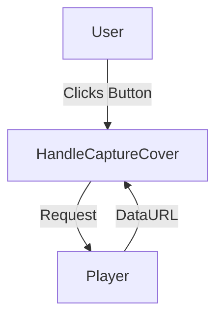
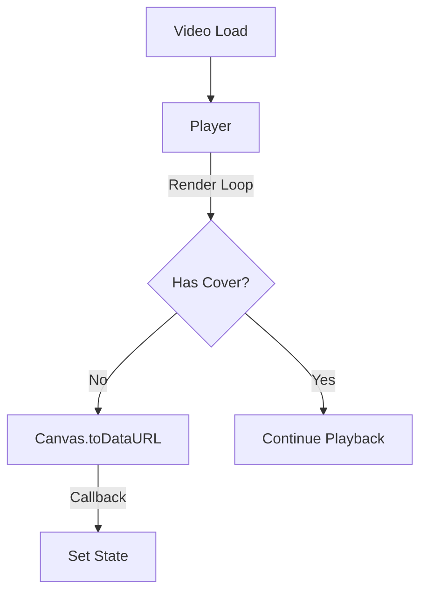

# Feature Specification Document: Auto-Cover Generation

## 1. Executive Summary

-   **Feature**: Auto-Cover Generation
-   **Status**: Implemented
-   **Summary**: This feature automatically captures the first valid frame of a newly loaded main video (whether uploaded or screen-recorded) and assigns it as the project's cover image. This ensures projects always have a visual thumbnail without requiring manual user intervention.

## 2. Design Philosophy & Guiding Principles

**Clarity vs. Power:**
-   **Guiding Question**: Is the primary goal for this feature to be immediately understandable and simple, or to be feature-rich and powerful for expert users?
-   **Our Principle**: **Prioritize Clarity.** The feature works invisibly in the background. The user simply sees a "Cover Set" status appear, removing the cognitive load of having to manually select a thumbnail.

**Convention vs. Novelty:**
-   **Guiding Question**: Should this feature leverage familiar, industry-standard patterns?
-   **Our Principle**: **Adhere to Convention.** Users expect video tools (like YouTube or file explorers) to automatically generate a thumbnail from the content.

**Guidance vs. Freedom:**
-   **Guiding Question**: How much should we guide the user?
-   **Our Principle**: **Provide strong guardrails.** We set a sensible default (the first frame) immediately. The user retains the freedom to override this manually later, but the "empty state" is eliminated.

**Forgiveness vs. Strictness:**
-   **Guiding Question**: How do we handle user error or system limitations?
-   **Our Principle**: **Design for Forgiveness.** If the video format prevents capture (e.g., CORS issues), the feature fails silently without disrupting the editing flow.

## 3. Problem Statement & Goals

-   **Problem**: When a user starts a new project by uploading a video or finishing a screen recording, the project metadata ("Cover Image") remains empty. This results in generic or blank previews when exporting or viewing project lists, requiring the user to perform a manual "Capture Cover" action every time.
-   **Goals**:
    *   Goal 1: Eliminate the "blank cover" state for new video projects.
    *   Goal 2: Provide immediate visual feedback that the video has loaded and is processed.
-   **Success Metrics**:
    *   Metric 1: 100% of CORS-compatible video imports result in a populated `coverImage` state.

## 4. Scope

-   **In Scope:**
    *   Automatic frame capture upon initial rendering of the `mainVideo`.
    *   Logic to reset the cover image when the main video asset is replaced.
    *   Integration with both File Upload and Screen Recording workflows.
    *   Graceful error handling for CORS-restricted videos.
-   **Out of Scope:**
    *   "Smart" thumbnail selection (e.g., detecting the most interesting frame). We simply use the first rendered frame.
    *   Auto-generation for audio-only projects (a default placeholder is sufficient).
    *   Background processing (capture happens on the main thread via the existing canvas render loop).

## 5. User Stories

-   As a **Creator**, I want **my uploaded video to automatically become the project thumbnail** so that **I don't have to manually click "Set Cover" for every quick edit**.
-   As a **Screen Recorder**, I want **the recording I just finished to generate a preview** so that **the exported file has a valid thumbnail immediately**.
-   As a **User**, I want **the cover image to update if I change the main video** so that **the thumbnail doesn't show the old, deleted video**.

## 6. Acceptance Criteria

-   **Scenario: Initial Video Upload**
    *   **Given**: The editor is empty and no cover image is set.
    *   **When**: I upload a valid `.mp4` file as the Main Video.
    *   **Then**: The "Set Cover" button in the top right changes to "Cover Set".
    *   **And**: The `coverImage` state contains a data URL.

-   **Scenario: Screen Recording Completion**
    *   **Given**: I am recording my screen.
    *   **When**: I click "Stop Recording".
    *   **Then**: The editor loads the recording.
    *   **And**: The cover image is automatically populated with the first frame of the recording.

-   **Scenario: Replacing Video**
    *   **Given**: I have a project with Video A and a generated cover.
    *   **When**: I replace Video A with Video B.
    *   **Then**: The old cover image is removed.
    *   **And**: A new cover image is generated from Video B.

## 7. UI/UX Flow & Requirements

-   **User Flow**:
    1.  User performs an action to load a video (Upload or Stop Recording).
    2.  The `App` state updates with the new video asset.
    3.  The `Player` component begins rendering the video to the canvas.
    4.  On the first successful paint (`video.readyState >= 2`), the `Player` detects that no cover exists.
    5.  The `Player` captures the canvas contents as a JPEG Data URL.
    6.  The `Player` calls the `onAutoCover` callback.
    7.  The UI updates the "Set Cover" button to indicate a cover exists.
-   **Visual Design**: No new UI elements. The existing "Set Cover" button state changes automatically.

## 8. Technical Design & Implementation

-   **High-Level Approach**:
    The logic is embedded in the `Player` component's `renderFrame` loop. This ensures we only attempt to capture the cover once the video allows us to draw it to the canvas, avoiding "black frame" issues common with simply querying the video element too early.
-   **Component Breakdown**:
    *   `Player.tsx`:
        *   Added `onAutoCover` prop.
        *   Added `autoCoverAttemptedRef` to ensure we only try to generate the cover once per video source.
        *   Implemented capture logic inside the `requestAnimationFrame` loop.
    *   `App.tsx`:
        *   Updated `loadEditorWithVideo` (recording handler) to explicitly set `coverImage: null` to trigger regeneration.
        *   Updated `updateStateWithAsset` to reset cover image when `main` video changes.
-   **Key Logic**:
    ```typescript
    // Inside renderFrame loop
    if (!coverImageRef.current && !autoCoverAttemptedRef.current && onAutoCover) {
        const dataUrl = canvas.toDataURL('image/jpeg', 0.7);
        if (dataUrl && dataUrl !== 'data:,') {
            onAutoCover(dataUrl);
            autoCoverAttemptedRef.current = true;
        }
    }
    ```

## 9. Data Management & Schema

### 9.1. Data Source
HTML5 Canvas (`toDataURL`).

### 9.2. Data Schema
Modified `ExtendedEditorState`:
```typescript
interface ExtendedEditorState {
  // ... existing fields
  coverImage: string | null; // Base64 encoded JPEG
}
```

### 9.3. Persistence
In-memory via React state.

## 10. Storage Compatibility Strategy (Critical)

| Feature Aspect | Firebase (Cloud) | Google Drive (BYOS) | Static Mirror (R2) |
| :--- | :--- | :--- | :--- |
| **Cover Storage** | String field in doc | String field in JSON | String field in JSON |
| **Size Constraints** | < 1MB (Base64) | < 10MB (File size) | N/A |

*Note: We use `image/jpeg` with `0.7` quality to ensure the base64 string remains relatively small for JSON storage.*

## 11. Limitations & Known Issues

-   **Limitation 1**: **CORS**. If a user imports a video via URL from a server that does not send `Access-Control-Allow-Origin`, the canvas becomes "tainted". `toDataURL` will fail. We catch this error silently; the user will just not get an auto-cover.
-   **Limitation 2**: **Black Frames**. If the first frame of the video is purely black (fade in), the cover will be black. We do not currently seek forward to find a "non-black" frame.

---

## 12. Architectural Visuals

### Before: Manual Trigger Only



### After: Auto-Trigger via Render Loop


