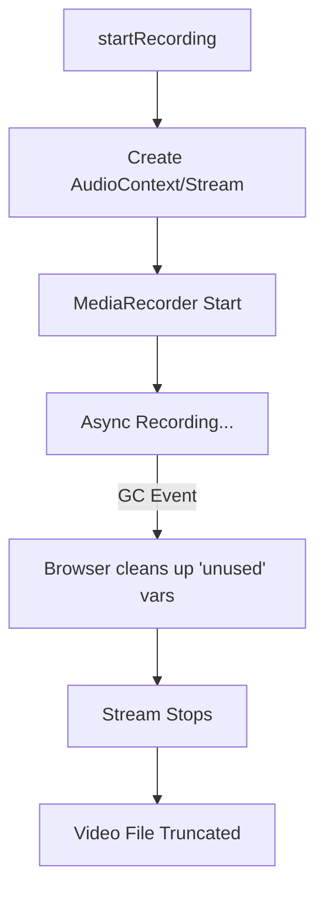

# Feature Specification Document: Fix Truncated Video Export

## 1. Executive Summary

-   **Feature**: Fix Truncated Video Export
-   **Status**: Implemented
-   **Summary**: Addresses a critical stability issue where exported videos were significantly shorter than the source timeline (e.g., a 10s project resulting in a 4s video). The fix ensures the recording engine maintains a continuous clock signal throughout the export process, regardless of audio gaps, buffering, or aggressive browser garbage collection.

## 2. Design Philosophy & Guiding Principles

**Reliability vs. Speed:**
-   **Guiding Question**: Should we optimize for the fastest possible export or the most reliable output?
-   **Our Principle**: **Reliability is non-negotiable.** An export tool that produces incomplete files is functionally broken. We prioritize maintaining a robust media stream over minor memory optimizations.

**Invisible Complexity:**
-   **Guiding Question**: Should the user be aware of the recording internals?
-   **Our Principle**: **Keep it invisible.** The user should simply click "Export" and get a valid file. The technical workaround (silent oscillators, persistent refs) should handle the browser's idiosyncrasies without user intervention.

## 3. Problem Statement & Goals

-   **Problem**:
    1.  **Garbage Collection**: The `AudioContext` and `MediaStream` objects created inside the export function were local variables. In long recordings, browsers (especially Chrome/Edge) would garbage collect them mid-recording, killing the audio track and stopping the `MediaRecorder`.
    2.  **Clock Stalling**: `MediaRecorder` relies on incoming data to advance its internal clock. If the source video buffered or had a silent audio track, the `AudioContext` would stop sending data packets. The recorder would interpret this as "pause" or "stop," resulting in a truncated file duration.
-   **Goals**:
    *   Goal 1: Ensure the exported video duration matches the timeline duration exactly.
    *   Goal 2: Prevent the recording from stopping prematurely during silent sections or video buffering.
-   **Success Metrics**:
    *   Metric 1: A 10.8s timeline results in a 10.8s (+/- 0.1s) exported video file.

## 4. Scope

-   **In Scope:**
    *   Modifications to the `useCanvasRecorder` hook.
    *   Lifecycle management of `AudioContext` and `MediaStream` objects.
    *   Implementation of a "Heartbeat" audio signal (Silent Oscillator).
    *   Changes to `MediaRecorder` data flushing strategy (`timeslice`).
-   **Out of Scope:**
    *   Changes to the UI/UX of the export modal.
    *   Modifications to the `Player` or `Timeline` rendering logic.
    *   Server-side rendering or non-realtime export.

## 5. User Stories

-   As a **Creator**, I want **my exported video to be the exact length of my edit** so that **the ending isn't cut off**.
-   As a **User**, I want **to export videos that have silent sections** without the recorder stopping because it thinks the stream has ended.

## 6. Acceptance Criteria

-   **Scenario: Exporting a Long Video**
    *   **Given**: A project with a duration of 15 seconds.
    *   **When**: I click "Export Video" and wait for completion.
    *   **Then**: The downloaded file duration is 15 seconds.

-   **Scenario: Exporting with Silence**
    *   **Given**: A project where the audio track is muted or has gaps.
    *   **When**: I export the video.
    *   **Then**: The video continues recording through the silence and does not truncate.

### Manual Test Cases

**Test Case ID:** `TC-EXPORT-01`
**Title:** `Verify Full Duration Export for Long Videos`
**Associated User Story:** `As a Creator, I want my exported video to be the exact length of my edit.`

**Preconditions:**
-   The editor is loaded with a video clip at least 15 seconds long.
-   Browser console is open (optional, to check for errors).

**Steps:**
1.  Import a video file that is > 10 seconds (e.g., 15s).
2.  Ensure the timeline duration reflects the full length (15s).
3.  Click the "Export Video" button in the header.
4.  Do not switch tabs; wait for the "Exporting..." progress bar to reach 100%.
5.  Wait for the file download to start automatically.
6.  Open the downloaded file in a media player (QuickTime, VLC, or Chrome).

**Expected Result:**
-   The video plays from 0:00 to 0:15.
-   The audio is synced.
-   The video does not cut off prematurely at the 4-10s mark.

---

**Test Case ID:** `TC-EXPORT-02`
**Title:** `Verify Export with Audio Gaps (Silence)`
**Associated User Story:** `As a User, I want to export videos that have silent sections.`

**Preconditions:**
-   Editor loaded with a video.

**Steps:**
1.  Import a video clip.
2.  Click the "Detach Audio" button in the toolbar.
3.  Delete the detached audio track (or mute it using the track mute button).
4.  (Optional) Add a background audio track that only covers the *second* half of the video, leaving the first half silent.
5.  Click "Export Video".
6.  Open the downloaded file.

**Expected Result:**
-   The exported file length matches the timeline length.
-   The recording did not stop when the audio was silent.

## 7. UI/UX Flow & Requirements

*No visible changes to the UI flow.* The fix is purely internal to the recording engine.

## 8. Technical Design & Implementation

-   **High-Level Approach**:
    1.  **Ref Persistence**: Moved `AudioContext` and `MediaStream` from local scope to `useRef`. This prevents the JavaScript engine from garbage collecting these objects while the asynchronous recording operation is running.
    2.  **Silent Oscillator (Heartbeat)**: Injected a web audio `Oscillator` connected to a `GainNode` with `value = 0` (silence) into the destination stream. This forces the `AudioContext` to constantly process blocks of audio, keeping the `MediaRecorder`'s clock ticking even if the actual video/audio source tracks are empty or buffering.
    3.  **Timeslice Flushing**: Changed `mediaRecorder.start()` to `mediaRecorder.start(1000)`. This forces the recorder to flush data to the `ondataavailable` handler every second, rather than buffering the entire file in memory until `stop()` is called.

-   **Component Breakdown**:
    *   `hooks/useCanvasRecorder.ts`:
        *   Added `audioContextRef` and `streamRefs`.
        *   Implemented `oscillator` logic in `startRecording`.
        *   Added cleanup logic in `stopRecording` to close context and stop tracks.

-   **Key Logic**:
    ```typescript
    // The Heartbeat Fix
    const oscillator = audioContext.createOscillator();
    const silentGain = audioContext.createGain();
    silentGain.gain.value = 0; // Silence
    oscillator.connect(silentGain);
    silentGain.connect(dest); // dest is passed to MediaRecorder
    oscillator.start();
    ```

## 9. Data Management & Schema

N/A - This feature handles transient stream data only.

## 10. Storage Compatibility Strategy

| Feature Aspect | Firebase (Cloud) | Google Drive (BYOS) | Static Mirror (R2) |
| :--- | :--- | :--- | :--- |
| **Export** | Client-side Blob | Client-side Blob | Client-side Blob |

This fix is strictly client-side and works independently of the storage backend.

## 11. Limitations & Known Issues

-   **Limitation 1**: **Real-time Export**. The export is still tied to the playback speed (1x). We cannot currently export faster than real-time because we rely on the DOM `HTMLCanvasElement` and `AudioContext`.
-   **Limitation 2**: **Browser Tab Focus**. Browsers throttle `requestAnimationFrame` and `AudioContext` when the tab is not active. Users must keep the tab open and visible during export, or the video might stutter (though it likely won't truncate anymore).

---

## 12. Architectural Visuals

### Before: Fragile Recording



### After: Robust Recording

```mermaid
graph TD
    Start[startRecording] --> Ref[Store Context in useRef]
    Ref --> Osc[Inject Silent Oscillator]
    Osc --> Stream[Continuous Audio Stream]
    Stream --> Rec[MediaRecorder Start(1000ms)]
    Rec --> Wait[Async Recording...]
    Wait -- "Buffering/Silence" --> Heartbeat[Oscillator keeps clock running]
    Stop[stopRecording] --> Cleanup[Close Context & Tracks]
    Cleanup --> File[Full Duration Video]
```
