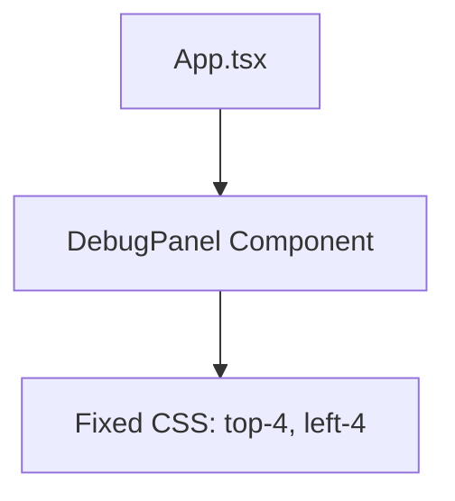
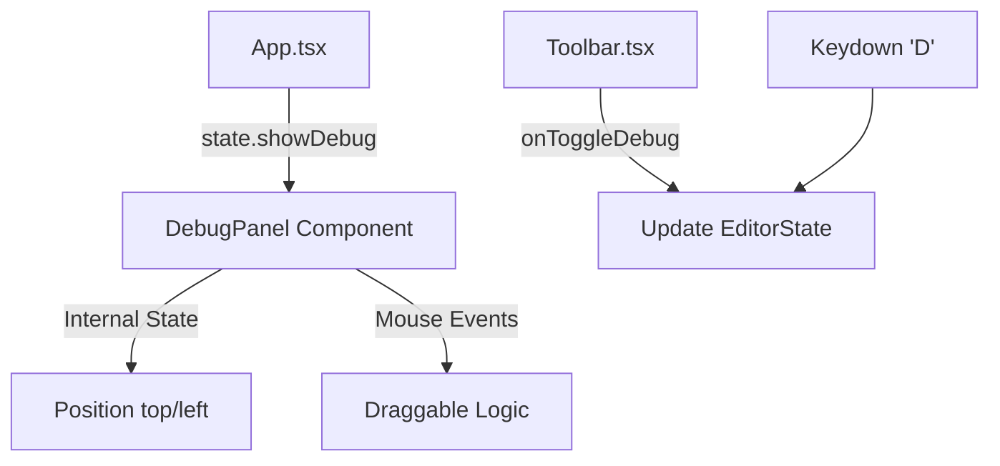

# Feature Specification Document: Toggleable and Draggable Performance Debug View

## 1. Executive Summary

-   **Feature**: Toggleable and Draggable Performance Debug View
-   **Status**: Implemented
-   **Summary**: Introduces a way for users to show/hide the performance diagnostic panel via a toolbar button or keyboard shortcut. The panel is also now draggable, allowing users to move it anywhere on the screen so it doesn't obstruct the main video editor interface.

## 2. Design Philosophy & Guiding Principles

**Clarity vs. Power:**
-   **Guiding Question**: Is the primary goal for this feature to be immediately understandable and simple, or to be feature-rich and powerful for expert users?
-   **Our Principle**: Prioritize clarity and non-intrusiveness. The debug view is powerful for performance analysis but stays hidden by default to keep the UI clean for the majority of users.

**Convention vs. Novelty:**
-   **Guiding Question**: Should this feature leverage familiar, industry-standard patterns, or should we introduce a novel interaction to solve the problem in a unique way?
-   **Our Principle**: Adhere to standard "developer tools" conventions. A toggle button in the toolbar and a keyboard shortcut (D) are familiar patterns for performance monitoring tools.

**Guidance vs. Freedom:**
-   **Guiding Question**: How much should we guide the user? Should we provide a highly opinionated, step-by-step workflow, or give them a flexible "sandbox" to work in?
-   **Our Principle**: Provide freedom. The draggable nature of the panel allows users to place it wherever it fits best within their specific workflow and screen layout.

**Forgiveness vs. Strictness:**
-   **Guiding Question**: How do we handle user error? Should the system prevent errors from happening, or make it easy to undo mistakes after they've been made?
-   **Our Principle**: Design for simplicity. Toggling is instantaneous, and the position is managed in-memory, making it easy to reset by simply toggling off and on (though currently it persists in memory until refresh).

**Aesthetic & Tone:**
-   **Guiding Question**: What is the emotional goal of this feature? What should the user feel?
-   **Our Principle**: Professional and high-tech. The panel uses a "terminal" aesthetic (green on black) to signal its diagnostic purpose.

## 3. Problem Statement & Goals

-   **Problem**: The performance diagnostic panel was previously hard-coded to be always visible at a fixed position, often obstructing the video player or sidebar and cluttering the UI for users who didn't need it.
-   **Goals**:
    *   Goal 1: Provide a way to hide the panel when not in use.
    *   Goal 2: Allow users to reposition the panel if it blocks content.
    *   Goal 3: Ensure quick access for developers/power users via keyboard shortcuts.
-   **Success Metrics**:
    *   Metric 1: User can toggle the panel state in < 1 second.
    *   Metric 2: User can drag the panel to any corner of the screen.

## 4. Scope

-   **In Scope:**
    *   `showDebug` state in global `EditorState`.
    *   Toggle button in the main `Toolbar`.
    *   Keyboard shortcut ('D') for toggling.
    *   Drag-and-drop functionality for the `DebugPanel` component.
    *   Visual indicators for draggability (cursor changes, drag handle).
-   **Out of Scope:**
    *   Persistent storage of panel position across sessions.
    *   Resizing of the debug panel.
    *   Multiple debug panel tabs.

## 5. User Stories

-   As a **Developer**, I want **to toggle the performance panel with a hotkey** so that **I can quickly check for frame drops without reaching for my mouse**.
-   As an **Editor**, I want **to drag the debug view to the bottom-right** so that **it doesn't block the video player's center view**.
-   As a **Regular User**, I want **the debug view to be hidden by default** so that **the interface stays clean and simple**.

## 6. Acceptance Criteria

-   **Scenario: Toggle via Toolbar**
    *   **Given**: The debug panel is hidden.
    *   **When**: The user clicks the Activity icon in the toolbar.
    *   **Then**: The Performance Diagnostic panel appears on screen.

-   **Scenario: Toggle via Keyboard**
    *   **Given**: The user is focused on the application.
    *   **When**: The user presses the 'D' key.
    *   **Then**: The Performance Diagnostic panel toggles its visibility.

-   **Scenario: Draggability**
    *   **Given**: The debug panel is visible.
    *   **When**: The user clicks and holds the header of the panel and moves the mouse.
    *   **Then**: The panel follows the mouse cursor.
    *   **And**: The panel stays at the new position when the mouse is released.

## 7. UI/UX Flow & Requirements

-   **User Flow**:
    1.  User clicks the "Activity" (pulse) icon in the right side of the toolbar.
    2.  Panel appears at default position (top-left, slightly offset).
    3.  User mouses over the "Performance Diagnostic" header. Cursor changes to `grab`.
    4.  User drags the panel to a new location. Cursor changes to `grabbing`.
-   **Visual Design**: The panel remains true to its diagnostic aesthetic but gains a "DRAG" label and a pulsing status indicator to signal it's active and movable.
-   **Copywriting**:
    *   Toolbar tooltip: "Toggle Performance Debug (D)"
    *   Panel Handle: "DRAG"

## 8. Technical Design & Implementation

-   **High-Level Approach**: Modified the global editor state to track visibility. Used standard React mouse event listeners (`mousemove`, `mouseup`) attached to the `window` during a drag operation to ensure smooth movement.
-   **Component Breakdown**:
    *   `types.ts`: Updated `EditorState` interface.
    *   `useEditor.ts`: Added `showDebug` state and `handleToggleDebug` callback.
    *   `Toolbar.tsx`: Added the `Activity` toggle button.
    *   `DebugPanel.tsx`: Added `useState` for position and dragging logic.
    *   `App.tsx`: Wired up the keyboard listener and conditional rendering.

## 9. Data Management & Schema

### 9.1. Data Source
User input (clicks, key presses, mouse movements).

### 9.2. Data Schema
```json
{
  "showDebug": "boolean",
  "position": { "top": "number", "left": "number" }
}
```

### 9.3. Persistence
In-memory state within the `useEditor` hook and `DebugPanel` component. Does not persist across page reloads.

## 10. Storage Compatibility Strategy (Critical)

| Feature Aspect | Firebase (Cloud) | Google Drive (BYOS) | Static Mirror (R2) |
| :--- | :--- | :--- | :--- |
| **Visibility State** | Not persisted | Not persisted | Not persisted |
| **Panel Position** | Not persisted | Not persisted | Not persisted |
| **Toggle Debug** | Works (Local Only) | Works (Local Only) | Works (Local Only) |

## 11. Limitations & Known Issues

-   **Limitation 1**: Position is not saved. Every time the panel is toggled off and on, it resets to its default position (or its last position if the component wasn't unmounted, but since it's conditionally rendered in `App.tsx`, it resets).
-   **Known Issue 1**: If the window is resized, a panel dragged to the far right might become partially off-screen.

---

## 12. Architectural Visuals (Optional)

### Before: Static Debug View



### After: State-Driven Draggable Debug View


